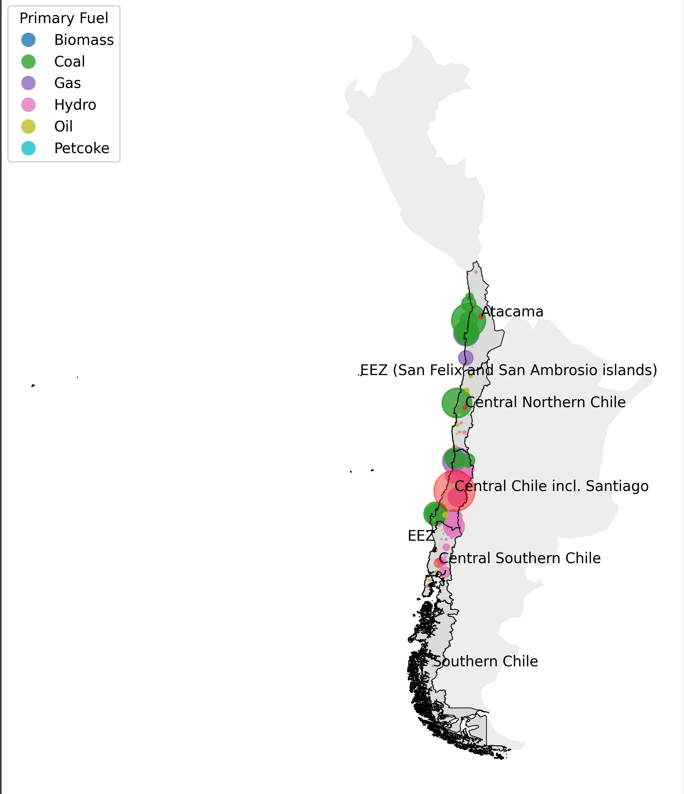
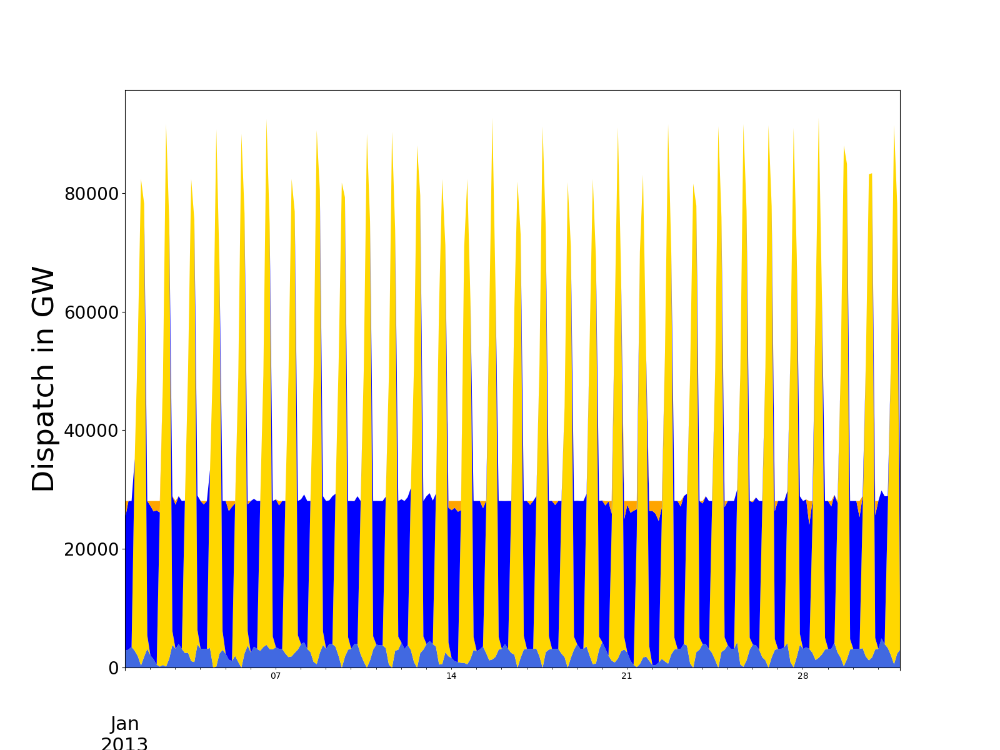
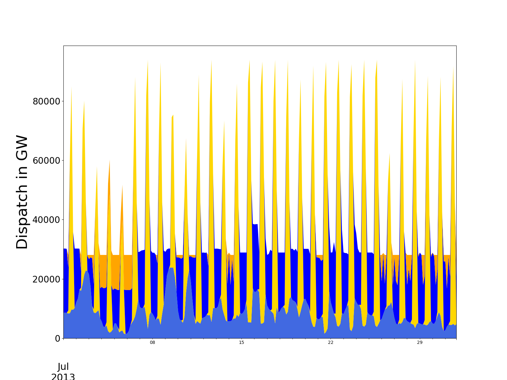
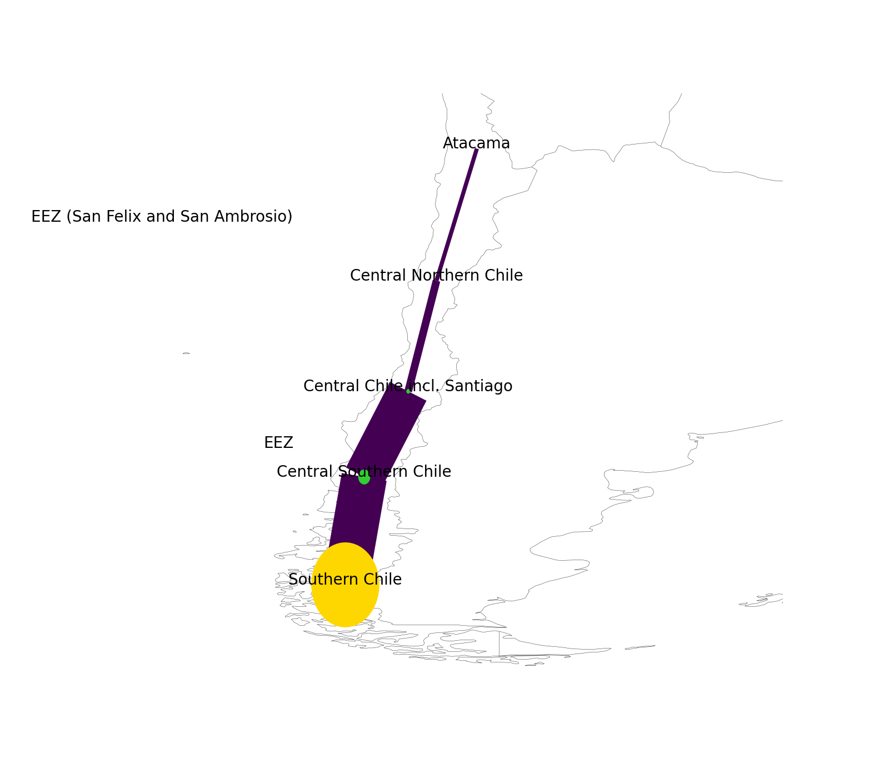
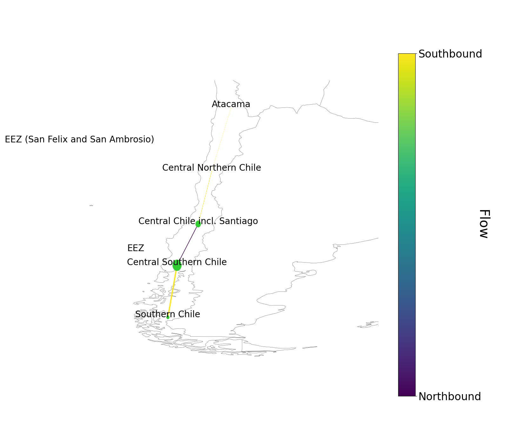
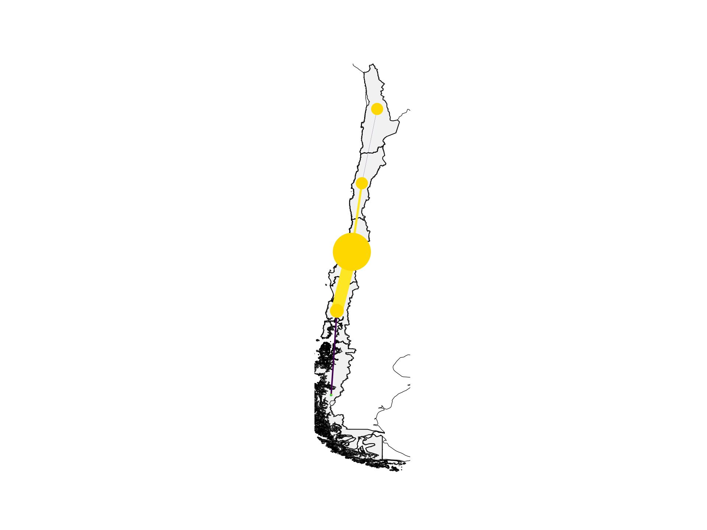

# The Future of Chile's Energy System: A Comprehensive Analysis

## Overview

This repository contains a comprehensive analysis of Chile's energy system transformation, examining the country's path towards renewable energy integration and regional grid optimization. The study combines geographical, demographic, and energy system modeling to assess Chile's renewable energy potential and simulate different future scenarios.

## Table of Contents

- [Project Description](#project-description)
- [Methodology](#methodology)
- [Chile's Energy Landscape](#chiles-energy-landscape)
- [Key Findings](#key-findings)
- [Data Sources](#data-sources)
- [Repository Structure](#repository-structure)
- [Results and Visualizations](#results-and-visualizations)
- [Installation and Usage](#installation-and-usage)
- [Dependencies](#dependencies)

## Project Description

This homework assignment analyzes Chile's energy system transformation through:

1. **Geographic and Demographic Analysis**: Comprehensive overview of Chile's unique geography and population distribution
2. **Current Energy System Assessment**: Analysis of existing fossil-based electricity generation and demand patterns
3. **Renewable Energy Potential**: Evaluation of solar, wind, and offshore renewable resources across Chilean regions
4. **Grid Integration Modeling**: Development of regional transmission network models
5. **Scenario Analysis**: Simulation of baseline and alternative future energy pathways
6. **Load-Generation Balance**: Assessment of power flows and regional electricity balances

## Methodology

### 1. Geographic Analysis
- Utilization of Chile's regional boundaries and administrative divisions
- Population density mapping and demographic distribution analysis
- Assessment of geographic constraints and opportunities for renewable energy

### 2. Renewable Energy Resource Assessment
- **Solar Energy**: Analysis of photovoltaic potential across different latitudes
- **Wind Energy**: Onshore and offshore wind resource evaluation
- **Hydroelectric**: Assessment of existing and potential hydroelectric capacity

### 3. Energy System Modeling
- Development of multi-regional energy system model using PyPSA (Python for Power System Analysis)
- Integration of transmission constraints and regional interconnections
- Temporal analysis with hourly resolution for representative periods

### 4. Scenario Development
- **Baseline Scenario**: Current energy mix and infrastructure
- **Renewable Transition Scenarios**: Various pathways for renewable energy integration
- **Grid Enhancement Scenarios**: Transmission capacity expansion options

## Chile's Energy Landscape

### Geography and Demographics
Chile's unique geography presents both challenges and opportunities:
- **Length**: Over 4,300 km north-south span
- **Width**: Average 180 km east-west
- **Regions**: 16 administrative regions with distinct energy profiles
- **Population**: Concentrated in central regions around Santiago

### Current Energy System
- **Electricity Demand**: Concentrated in central regions with industrial clusters
- **Generation Mix**: Historically dependent on fossil fuels (coal, natural gas, oil)
- **Grid Infrastructure**: North-south transmission corridor with regional interconnections

### Renewable Energy Potential
- **Solar**: Exceptional solar irradiation in northern Atacama Desert region
- **Wind**: Strong wind resources along extensive coastline
- **Offshore Wind**: Significant potential in southern coastal areas
- **Hydroelectric**: Existing capacity in central and southern regions

## Key Findings

The analysis reveals several critical insights:

1. **Regional Complementarity**: Northern solar and southern wind resources complement each other seasonally
2. **Transmission Importance**: Grid infrastructure crucial for balancing renewable variability
3. **Seasonal Patterns**: Winter-summer demand variations require flexible generation portfolio
4. **Offshore Potential**: Significant untapped offshore wind resources in southern regions

## Data Sources

- **Geographic Data**: GADM administrative boundaries, EEZ maritime boundaries
- **Renewable Resources**: ERA5 reanalysis data via Atlite toolkit
- **Electricity Demand**: Historical load profiles and projections
- **Generation Assets**: Global Power Plant Database
- **Grid Infrastructure**: Transmission line networks and capacity data

## Repository Structure

```
├── code/                          # Jupyter notebooks and Python scripts
│   ├── HW4_groupB_PyPsa_Model_Final.ipynb  # Main analysis notebook
│   └── Untitled-1.ipynb          # Additional analysis
├── data/                          # Input data files
│   ├── chile_regions.gpkg         # Regional boundaries
│   ├── load.csv                   # Electricity demand data
│   ├── A_Solar.csv               # Solar availability factors
│   ├── A_Wind.csv                # Wind availability factors
│   ├── A_Offshore.csv            # Offshore wind data
│   └── global_power_plant_database.csv
├── Grafiken/                      # Results and visualizations
├── clean_env/                     # Python virtual environment
└── README.md                      # This file
```

## Results and Visualizations

### 1. Regional Energy Distribution

*Figure 1: Geographic distribution of energy nodes across Chilean regions, showing the concentration of demand in central areas and renewable potential in northern and southern regions.*

### 2. Seasonal Generation Patterns

#### Summer Generation (January 2020)

*Figure 2: Daily electricity generation patterns during summer months (January 2020), showing high solar contribution during peak daylight hours and consistent baseload from conventional sources.*

#### Winter Generation (July 2020)

*Figure 3: Daily electricity generation patterns during winter months (July 2020), demonstrating increased reliance on conventional sources and wind generation during reduced solar availability.*

### 3. Transmission Network Analysis

#### Baseline Network Configuration

*Figure 4: Power flow analysis for the baseline transmission network, illustrating north-south electricity transfers and regional load-generation balances.*

#### Winter Network Flows

*Figure 5: Transmission network flows during winter period, showing increased power transfers from central generation to northern and southern demand centers.*

### 4. System Performance Metrics

*Figure 6: Comprehensive system performance analysis for summer baseline scenario, including generation mix, transmission utilization, and load satisfaction metrics.*

## Installation and Usage

### Prerequisites
```bash
# Python 3.8+ required
# Virtual environment recommended
```

### Setup
```bash
# Clone the repository
git clone [repository-url]
cd desesm-group-assignment-main

# Activate virtual environment
clean_env\Scripts\activate

# Install dependencies
pip install -r requirements.txt
```

### Running the Analysis
```bash
# Launch Jupyter notebook
jupyter notebook code/HW4_groupB_PyPsa_Model_Final.ipynb
```

## Dependencies

Key Python packages used in this analysis:

- **PyPSA**: Power system analysis and optimization
- **Atlite**: Renewable energy time series generation
- **Geopandas**: Geospatial data processing
- **Pandas/Numpy**: Data manipulation and analysis
- **Matplotlib/Plotly**: Visualization and plotting
- **Rasterio**: Raster data processing
- **Xarray**: Multi-dimensional data arrays

```python
# Core dependencies
import pypsa
import atlite
import geopandas as gpd
import pandas as pd
import numpy as np
import matplotlib.pyplot as plt
import xarray as xr
import rasterio
```

## Research Context

This analysis was conducted as part of the **Data Science for Energy System Modeling (DSEM)** course at TU Berlin. The study demonstrates the application of data science methodologies to real-world energy system challenges, combining:

- **Geographic Information Systems (GIS)** for spatial analysis
- **Time Series Analysis** for renewable resource assessment
- **Optimization Modeling** for system design
- **Scenario Analysis** for policy evaluation

## Future Work

Potential extensions of this analysis include:

1. **Higher Temporal Resolution**: Hourly analysis for full year
2. **Storage Integration**: Battery and pumped hydro storage optimization
3. **Demand Response**: Flexible demand modeling and integration
4. **Economic Analysis**: Cost optimization and investment planning
5. **Climate Scenarios**: Impact of climate change on renewable resources

## Authors

Group B - TU Berlin DSEM Course

## License

This project is developed for educational purposes as part of the TU Berlin curriculum.

---

*For questions or additional information, please refer to the Jupyter notebooks in the `code/` directory or contact the course instructors.*